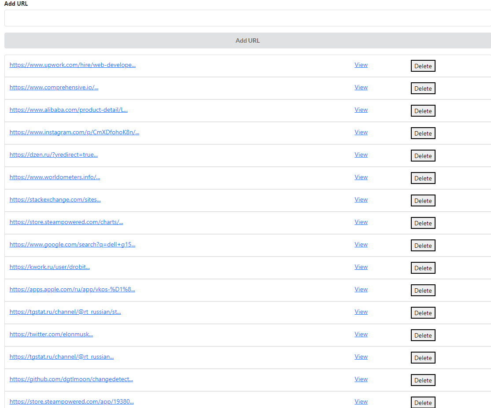
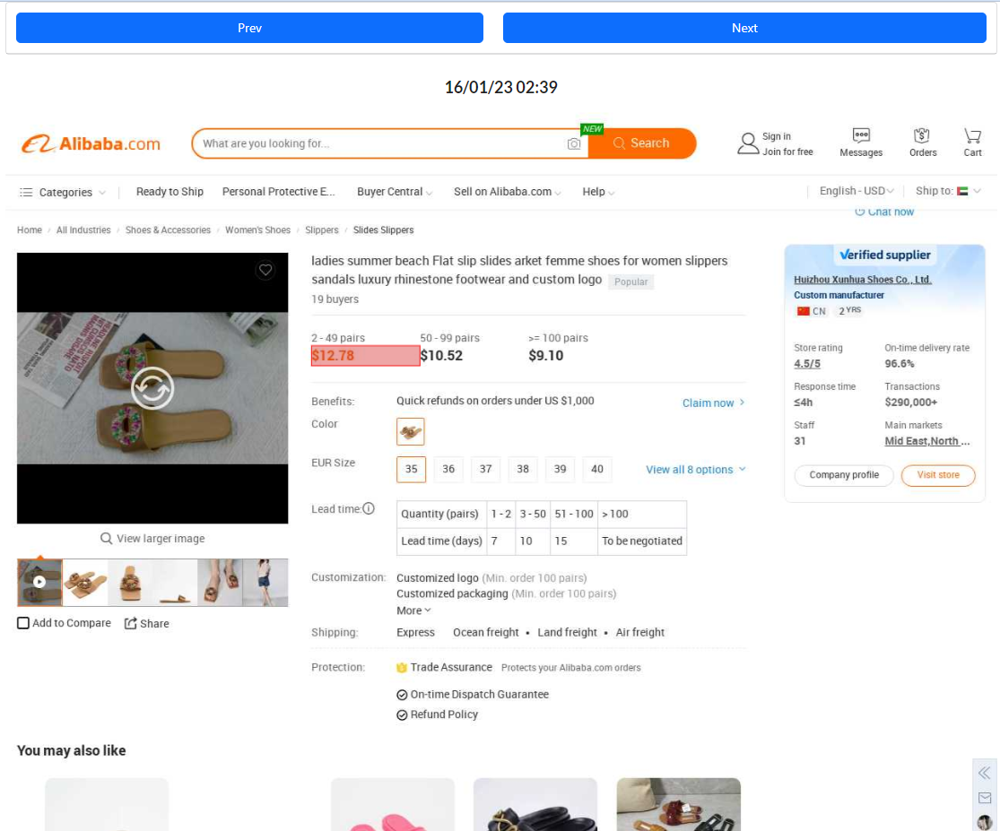
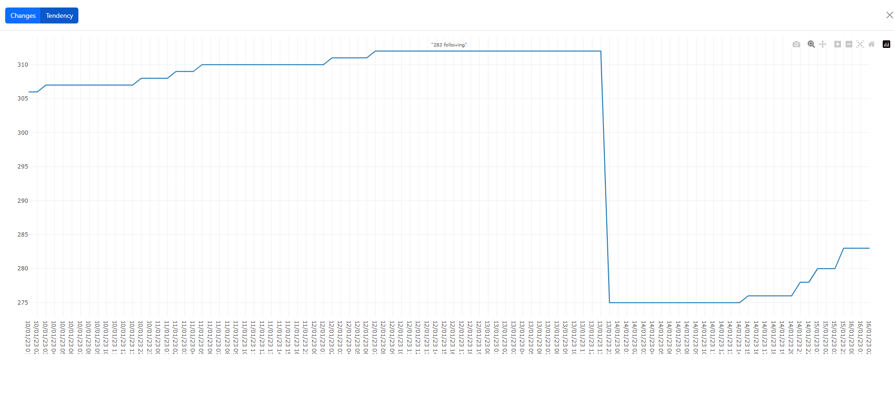
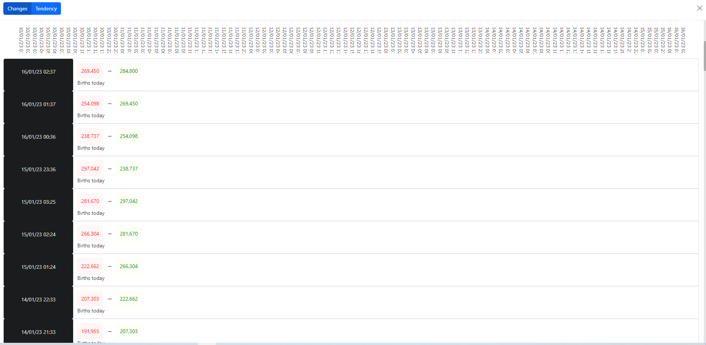

# What is this project about?

This is an advanced tool to monitor each web-page element history on any web site.  
You can track history of any element as tendency or as simple changes history.     
This is the MVP (dirty one), but I dont sure, if i will proceed developing it.  

Technological stack behind: 

- Python/Flask
- MongoDB
- ReactJS
- Headless Playwright Browser (optimized for multiple web sites loading)
- Docker + Docker Compose (not full stack described in there!)

How to run:

- run docker-compose to setup MongoDB database
- run frontend app (not listed in compose file yet)
- run backend app (not listed in compose file yet)
- run headless browser  (not listed in compose file yet)

Sites List:

Element Selector:

Changes as tendency:

Changes as history:

# ToDo

- keep cookies for popular web sites
	- update cookie after page load
- timer-based scrapping (30m, 1h, 5h, 24h)
- look at history snapshots (left, right scroller)
- spread fetching by domain name frequency 
	- use proxy if too fast even after spreading
	- use domain db with `domain` and `last_fetch` fields
- shrink snapshot data
	- if the same xpath detected in last 5 snapshots, make link instead of file
	- do not send repeated data to client (pass same points)
- remove repeated texts in element selection
- check entire page changes button
- fetcher sleep dependant from bunch size (should be more if 1-2 sites)
- UTC to local time on graph
- onmouseout from canvas, clear canvas

# UI

- back click in graph view -> close graph (via router)
- text of selected element in toast
- show only what added\deleted in changes
- changes sort order desc

# Bugs

# Promo

- producthunt
- zenlink
- facebook
- google search query "site tracker"
- offer to belingcat

# Use cases

- spy on people's social pages (LinkedIn, Facebook, Instagram, Tiktok)
- spy on people's activity in internet (forums, resumes, blogs)
- monitor people`s activity in internet
- track prices and rating changes in any marketplace (Amazon, Alibaba, Noon and many more)
- track new sections and items on web sites (GitHub, new StackOverflow sites)
- track trends changes in web
- track competitor actions in their web sites (other sellers on marketplaces, landing pages)
- track information changes on web sites
- monitor documentation changes (API, law)
- track popularity

# Exapmles

- Dubai Mall shops list tracker (detected new place)
- Kwork/freelance services demand tracker (rival orders)
- Ikea item popularity tracker 
- Linkedin employee monitor (looking new job)
- track youtube videos popularity (marketing research)